# Data_Analysis_CES

  
   
  <em>Trends in US Computer, Engineering, & Science Occupations</em>

\
Examination of Computer, Engineering, and Science Occupations in the United States utilizing the IPUMS US dataset. Our study delves into employment patterns across diverse occupational categories within four key domains: diversity, employment trends, education, and industry over the American Community Survey (ACS) 5-year period from 2017 to 2021.

1. Diversity: gender and age, ethnicity and race

2. Employment Trends: wage ranking, wage distribution

3. Education: educational level, major

4. Industry: industry distribution, the largest share of occupations 

## Diversity: 

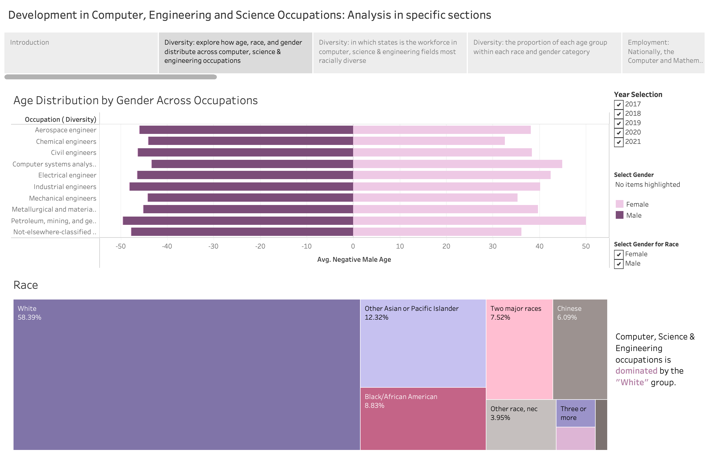
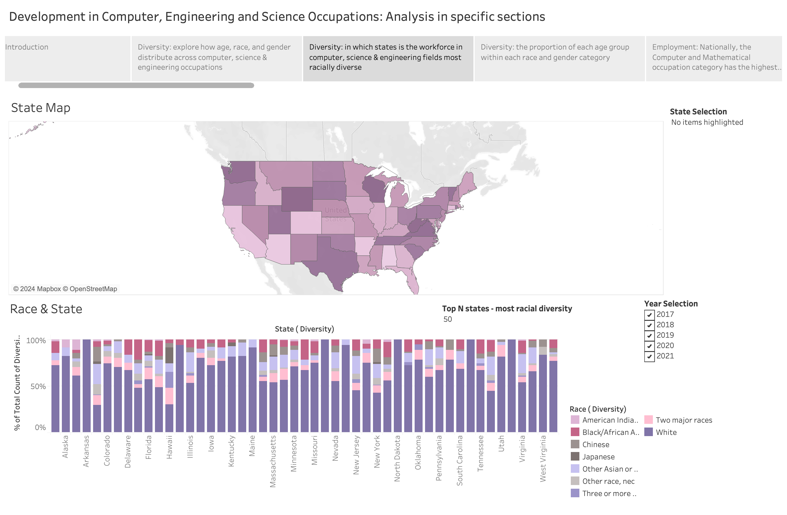
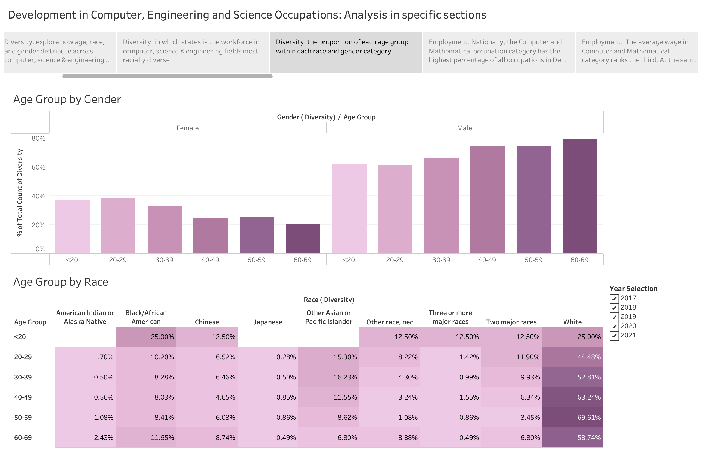

## Employment Trends:

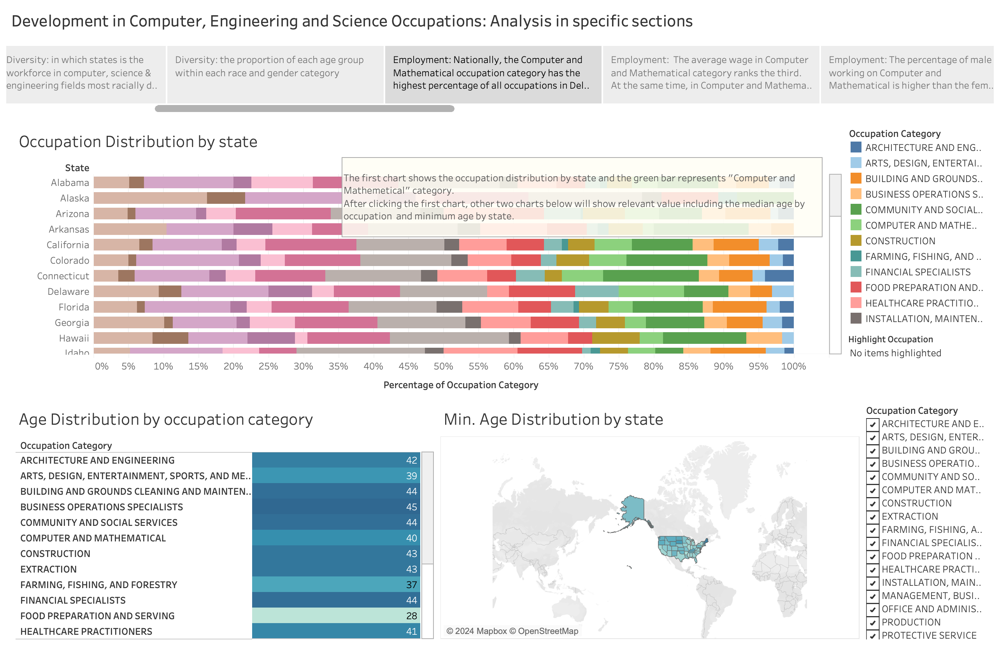
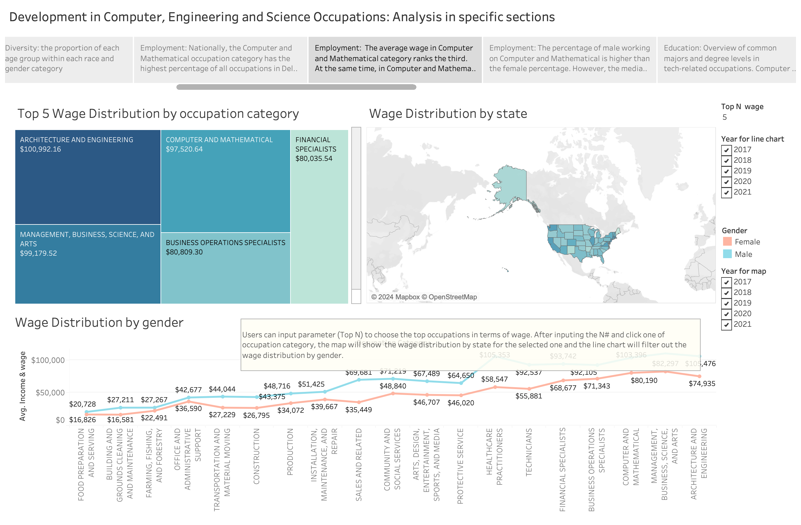
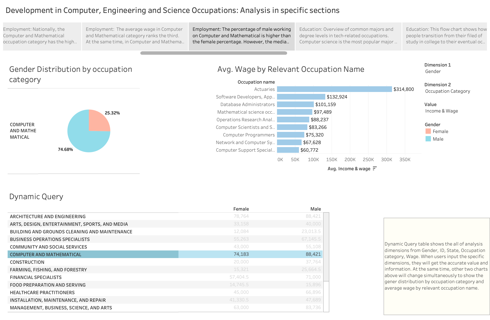

## Education: 

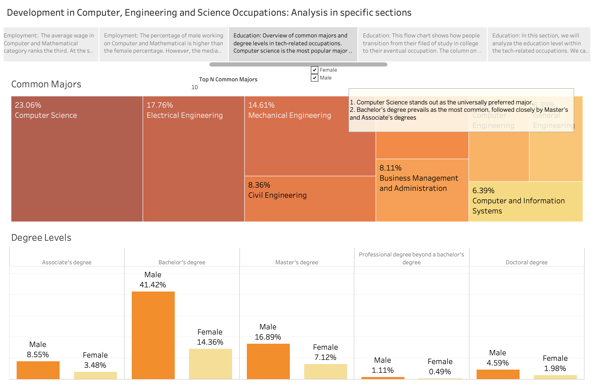
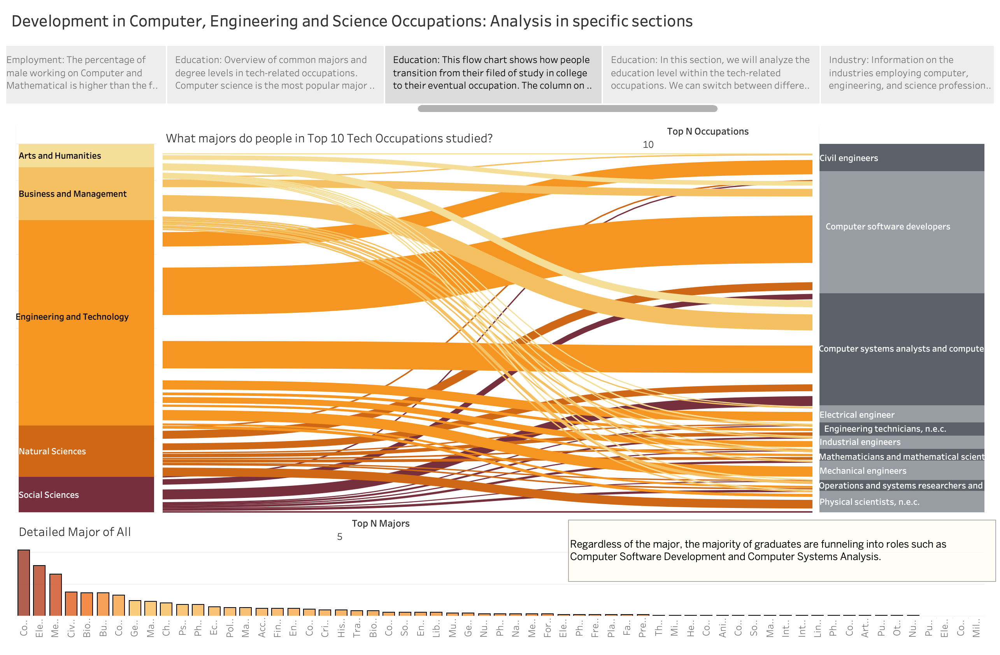
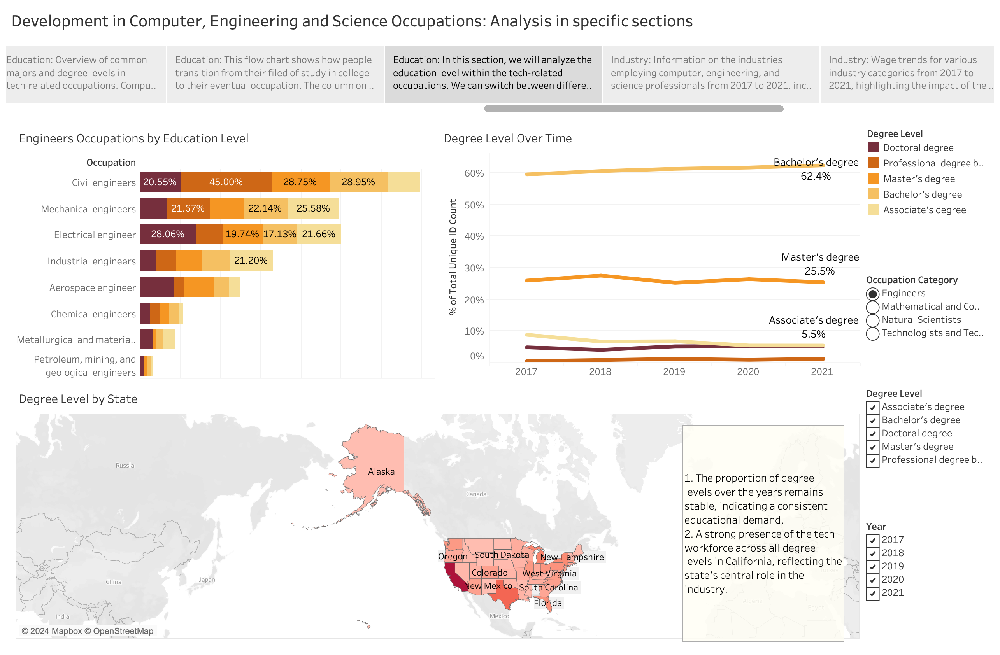

## Industry:

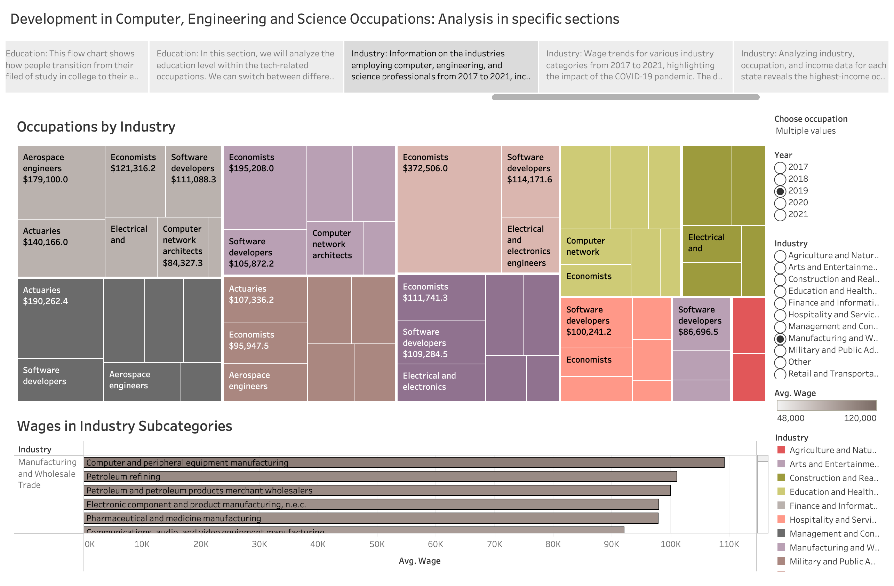
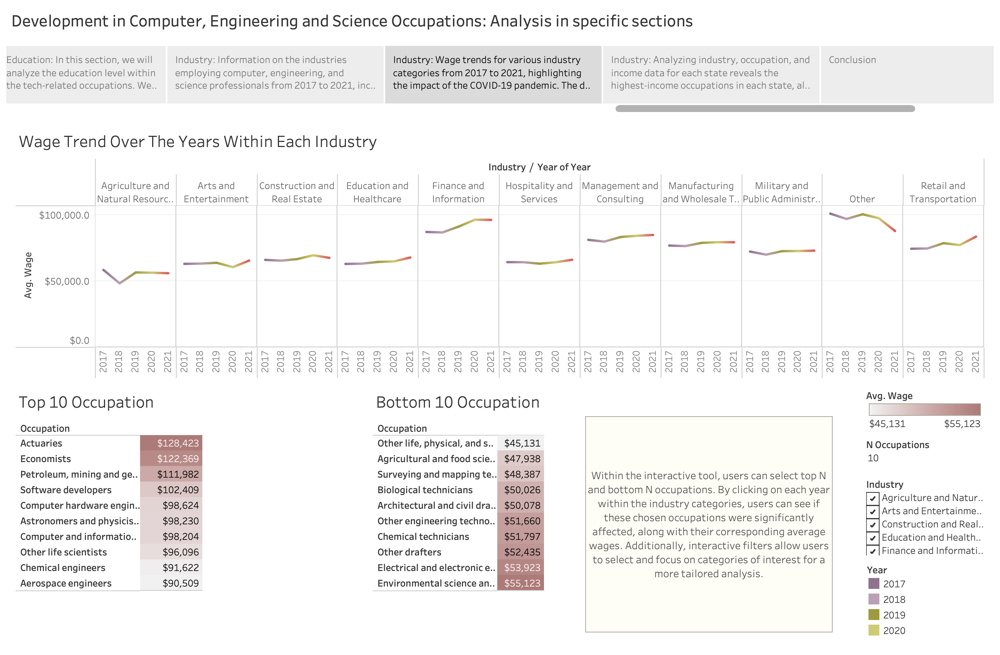
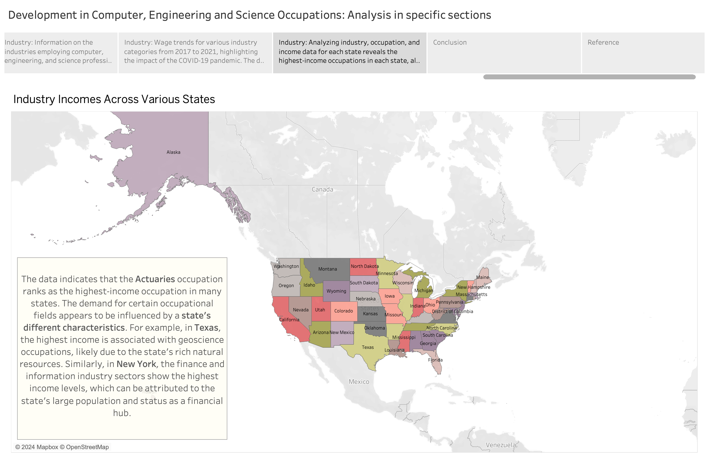

## Contact: 
For more information on the project, please contact one of the team members:  
Parisima Abdali: [pa2297@nyu.edu](mailto:pa2297@nyu.edu)  
Yining Wang: [yw6651@nyu.edu](mailto:yw6651@nyu.edu)  
Jiaan Cao: [jc12813@nyu.edu](mailto:jc12813@nyu.edu)  
Keyi Wang: [kw3286@nyu.edu](mailto:kw3286@nyu.edu)   
